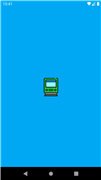
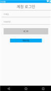
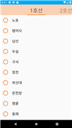
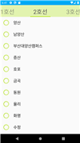
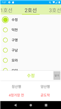
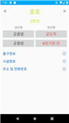
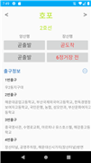
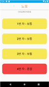
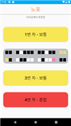

# (노약자.임산부를 위한) 잔여 좌석 확인 앱 서비스
소프트웨어개발실습4 102분반
- Github address : https://github.com/lee-hees/soft4_102

## 개발자 정보
- 팀장 : 이희승
- 팀원 : 이수호
- 팀원 : 변진원
- 팀원 : 이창열

## 프로젝트 개요
- 타사 앱에서는 각 객실의 좌석을 확인할 수 없음
- 지하철 이용객 및 노인 인구 증가
- 40대 이상 스파트폰 보유량 증가
- 지하철 각 객실의 혼잡도와 도착 시간 예측 앱 서비스 구현

## 프로젝트 개발 환경
- 개발환경 - Android Studio 4.1.1
- 개발언어 - Kotlin 1.4.21
- 데이터베이스 - Firebase 19.2.1

## 프로젝트 개발 내용

### 로그인
- Firebase 데이터베이스에서 회원 관리

### 호선 및 역 선택
- 탭 호선 및 역 List 변경, 호선별 색상 변환
- 역 선택시 선택 전,후 이미지 변환, 간이 정보 화면 출력
- 역 도착 정보 확인 가능
- 간이 정보 닫기 버튼 구현

### 상세 정보
- 간이 정보에서 intent 전달
- 좌,우 버튼 클릭 시 역 이동
- 출구, 시설, 주소 및 전화번호 (상세)정보 확인 가능
- 역 도착 정보 확인 가능 및 버튼 클릭 시 혼잡 정보 화면 이동

### 혼잡도 및 좌석 정보
- 데이터베이스의 실시간 좌석 정보를 이용해 혼잡도 표시
- 노약자 및 임산부 전용석 유무 확인 가능
- 열차의 객차 버튼 클릭 시 실시간 좌석 정보 화면 출력

## 스크린샷
</img>
</img>
</img>
 
</img>
</img>
</img>
 
</img>
</img>
 
</img>
</img>

## 최종 발표 PPT
</img>
</img>
</img>
</img>
</img>
</img>
</img>
</img>
</img>
</img>
</img>
</img>
</img>
</img>
</img>
</img>
</img>
</img>
</img>
</img>
</img>
</img>
</img>
</img>
</img>
</img>
</img>
</img>
</img>
</img>
</img>
</img>
</img>
</img>
</img>

